# MySQL函数和JDBC

# 学习目标

- [ ] 能够使用常见的函数
- [ ] 能够理解JDBC的概念
- [ ] 能够使用DriverManager类
- [ ] 能够使用Connection接口
- [ ] 能够使用Statement接口
- [ ] 能够使用ResultSet接口
- [ ] 能够说出SQL注入原因和解决方案
- [ ] 能够通过PreparedStatement完成增、删、改、查
- [ ] 能够完成PreparedStatement改造登录案例
- [ ] 能够使用JDBC操作事务

# 第一章-MySql常见的函数

## 知识点-MySql函数的介绍

### 1.目标

- [ ] 掌握为什么要学习MySql函数

### 2.路径

1. 使用MySql函数的目的
2. 函数可以出现的位置

### 3.讲解

#### 3.1使用MySql函数的目的

​	为了简化操作，MySql提供了大量的函数给程序员使用（比如你想输入当前时间，可以调用now()函数）

#### 3.2函数可以出现的位置

​	插入语句的values()中，更新语句中，删除语句中，查询语句及其子句中。

#### 3.3环境准备

```sql
-- 用户表
CREATE TABLE t_user (
  id int(11) NOT NULL AUTO_INCREMENT,
  uname varchar(40) DEFAULT NULL,
  age int(11) DEFAULT NULL,
  sex int(11) DEFAULT NULL,
  PRIMARY KEY (id)
);

insert  into t_user values (null,'zs',18,1);
insert  into t_user values (null,'ls',20,0);
insert  into t_user values (null,'ww',23,1);
insert  into t_user values (null,'zl',24,1);
insert  into t_user values (null,'lq',15,0);
insert  into t_user values (null,'hh',12,0);
insert  into t_user values (null,'wzx',60,null);
insert  into t_user values (null,'lb',null,null);

```


### 4.小结

1. 为什么要学习函数

   ​	满足一些特需的需要.


## 知识点-if相关函数(重点)

### 1.目标

- 掌握if相关函数的使用

### 2.路径

- if函数
- ifnull函数

### 3.讲解

#### 3.1 if函数

##### 3.1.1 语法

```mysql
if(expr1,expr2,expr3)
```

​	说明： 如果 *expr1* 是TRUE，则 IF()的返回值为*expr2*; 否则返回值则为 *expr3*。if() 的返回值为数字值或字符串值，具体情况视其所在语境而定。

##### 3.1.2 示例

练习1：获取用户的姓名、性别，如果性别为1则显示1，否则显示0；要求使用if函数查询：

```mysql
SELECT uname, IF(sex, 1, 0) FROM t_user;
```

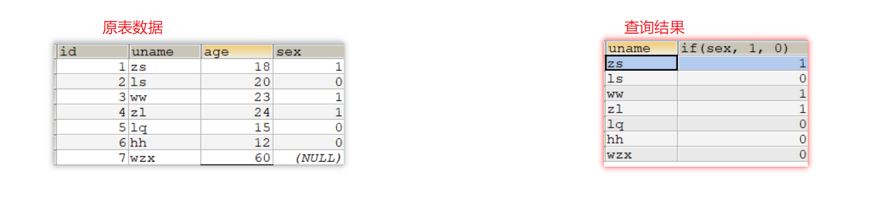

#### 3.2 ifnull函数

##### 3.2.1 语法

```mysql
ifnull(expr1,expr2)
```

说明：假如*expr1* 不为 NULL，则 IFNULL() 的返回值为 *expr1*; 否则其返回值为 *expr2*。ifnull()的返回值是数字或是字符串，具体情况取决于其所使用的语境。

##### 3.2.2 示例

练习1：获取用户的姓名、性别，如果性别为null则显示为1；要求使用ifnull函数查询：

```mysql
SELECT uname, IFNULL(sex, 1) FROM t_user;
```

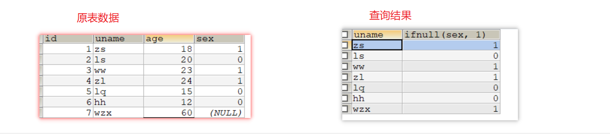

### 4.小结

- if函数的语法

  ```mysql
  if(exp1, exp2, exp3)
  ```

- ifnull函数的语法

  ```mysql
  ifnull(exp1, exp2)
  ```

  


## 知识点-字符串函数(练习一遍就够)

### 1.目标

- 掌握常见字符串函数的使用

### 2.路径

1. 字符串连接函数
2. 字符串大小写处理函数
3. 移除空格函数

5. 子串函数

### 3.讲解

#### 3.1 字符串连接函数

字符串连接函数主要有2个：

| 函数或操作符                          | 描述                                     |
| ------------------------------------- | ---------------------------------------- |
| concat(str1, str2, ...)               | 字符串连接函数，可以将多个字符串进行连接 |
| concat_ws(separator, str1, str2, ...) | 可以指定间隔符将多个字符串进行连接；     |

练习1：使用concat函数显示出 你好,uname 的结果

```mysql
SELECT CONCAT('你好,' , uname) FROM t_user;
```

练习2：使用concat_ws函数显示出 你好,uname 的结果

```mysql
SELECT CONCAT_WS(',', '你好', uname) FROM t_user;
```


#### 3.2 字符串大小写处理函数

字符串大小写处理函数主要有2个：

| 函数或操作符 | 描述              |
| ------------ | ----------------- |
| upper(str)   | 得到str的大写形式 |
| lower(str)   | 得到str的小写形式 |

练习1： 将字符串 hello 转换为大写显示

```mysql
SELECT UPPER('hello'); -- HELLO
```

练习2：将字符串 heLLo 转换为小写显示

```mysql
SELECT LOWER('heLLo'); -- hello
```


#### 3.3 移除空格函数

可以对字符串进行按长度填充满、也可以移除空格符

| 函数或操作符 | 描述                  |
| ------------ | --------------------- |
| trim(str)    | 将str两边的空白符移除 |

练习1： 将用户id位8的用户的姓名的两边空白符移除

```mysql
-- 表中数据是：'      lb   ', 使用trim后是： 'lb'
SELECT TRIM(uname) FROM t_user  WHERE id = 8; 
```


#### 3.5 子串函数

字符串也可以按条件进行截取，主要有以下可以截取子串的函数;

| 函数或操作符          | 描述                                                         |
| --------------------- | ------------------------------------------------------------ |
| substr()、substring() | 获取子串： 1：substr(str, pos) 、substring(str, pos)； 2：substr(str, pos, len)、substring(str, pos, len) |

练习1：获取 hello,world 从第二个字符开始的完整子串

```mysql
SELECT SUBSTR("hello,world", 2);  -- ello,world
```

练习2：获取 hello,world 从第二个字符开始但是长度为4的子串

```mysql
SELECT SUBSTR("hello,world", 2, 4); -- ello
```

### 4.小结

1. 拼接字符串

```
concat(str1,str2,...)
concat_ws(分隔符,str1,str2,...)
```

2.处理大小写的

``` 
upper(str)  变大写
lower(str)  变小写
```

3. 移除空格

```
trim(str);
```

4. 截取字符串

```
substr(str, pos)  str要截取的字符串,pos从哪里开始截取;
substr(str, pos, len) str要截取的字符串,pos从哪里开始截取, len截取字符串的长度
```


## 知识点-时间日期函数(练习一遍就够)

### 1.目标

- 掌握常见时间日期函数的使用

### 2.路径

- 表示特定时间的函数

### 3.讲解

mysql提供了一些用于获取特定时间的函数（主要用在添加或者更新数据）：

| 函数或操作符   | 描述                                            |
| -------------- | ----------------------------------------------- |
| current_date() | 获取当前日期，如 `2019-10-18`                   |
| current_time() | 获取当前时：分：秒，如：`15:36:11`              |
| now()          | 获取当前的日期和时间，如：`2019-10-18 15:37:17` |

练习1：获取当前的日期

```mysql
select cruuent_date();
```

练习2： 获取当前的时间（仅仅需要时分秒）

```mysql
select current_time();
```

练习3： 获取当前时间（包含年月日时分秒）

```mysql
select now();
```

### 4.小结

1. 获得当前日期

```
current_date()
```

2. 获得当前时间

```
current_time()
```

3. 获得当前日期,时间

```
now()
```


## 知识点-数值函数(练习一遍就够)

### 1.目标

- 掌握常见的数值函数

### 2.分析

- 掌握常见数值函数

### 3.讲解

常见的数值相关函数如下表:

| 函数或操作符 | 描述                          |
| ------------ | ----------------------------- |
| abs(x)       | 获取数值x的绝对值             |
| ceil(x)      | 向上取整，获取不小于x的整数值 |
| floor(x)     | 向下取整，获取不大于x的整数值 |
| pow(x, y)    | 获取x的y次幂                  |
| rand()       | 获取一个0-1之间的随机浮点数   |

练习1： 获取 -12 的绝对值

```mysql
select abs(-12);
```

练习2： 将 -11.2 向上取整

```mysql
select ceil(-11.2);
```

练习3： 将 1.6 向下取整

```mysql
select floor(1.6);
```

练习4： 获得2的32次幂的值

```mysql
select pow(2, 32);
```

练习5： 获得一个在0-100之间的随机数

```mysql
select rand()*100;
```

### 4.小结

1. 绝对值

```
abs(x);
```

2. 向上取整

```
ceil(x);
```

3. 向下取整

```
floor(y)
```

4. 求x的y次方

```
pow(x,y);
```

5. 0-1之间随机数

```
rand();
```


# 第二章-JDBC入门

## 知识点-JDBC概述

### 1.目标

- 掌握为什么要学习JDBC和JDBC的概念

### 2.分析

1. 没有JDBC


2. 有了JDBC后


### 3.讲解

#### 3.1什么是JDBC

​	JDBC(java database connectivity): sun公司为了简化和统一java连接数据库,定义的一套规范(API,接口). 

#### 3.2JDBC和驱动的关系

​	接口(JDBC)与实现(驱动jar包)的关系

### 4.小结

1. 为什么要学习JDBC?   为了java连接/操作数据库更加的简单方便, 学习成本减低

2. JDBC和驱动关系?

   ​	Jdbc 规范(大量接口,少量的类)

   ​	驱动 实现

## 案例-JDBC快速入门

### 准备工作

```sql
create database day18;

use day18;

create table user(
	id int primary key auto_increment,
	username varchar(20),
	password varchar(20),
	nickname varchar(20)
);

INSERT INTO `USER` VALUES(null,'zs','123456','老张');
INSERT INTO `USER` VALUES(null,'ls','123456','老李');
INSERT INTO `USER` VALUES(null,'wangwu','123','东方不败');
```

### 1.需求

​	查询所有的用户, 输出到控制台

### 2.步骤

1. 创建Java工程, 拷贝驱动jar包
2. 加载驱动
3. 获得连接
4. 创建执行sql语句对象
5. 执行sql语句, 处理结果
6. 释放资源


### 3.代码实现

1. 驱动jar包导入项目

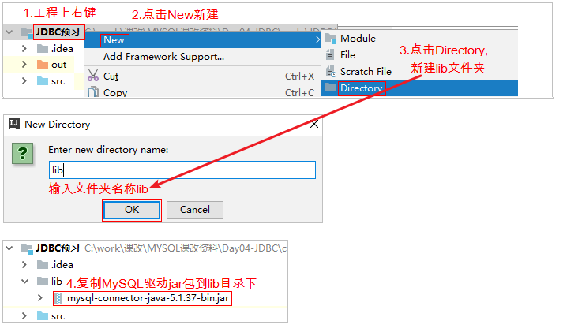


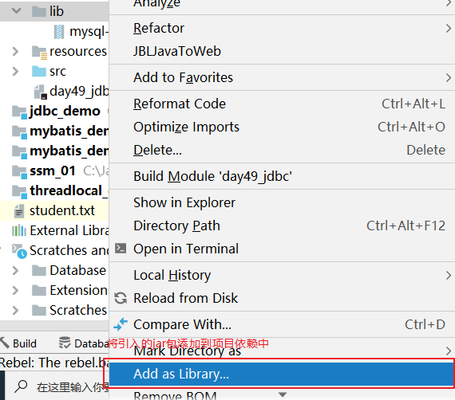

 

 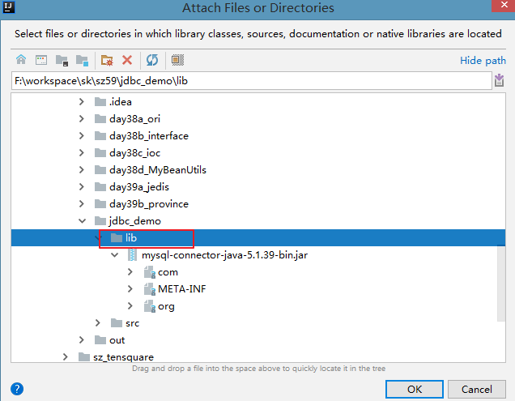

2. 代码实现

```java
	public static void main(String[] args) throws SQLException {
		//注册驱动
		DriverManager.registerDriver(new Driver());
		String url = "jdbc:mysql://localhost:3306/day10?characterEncoding=utf8";
		String user = "root";
		String password = "123";
		//获得连接
		Connection connection = DriverManager.getConnection(url, user, password);
		//创建执行sql语句对象
		Statement statement = connection.createStatement();
		//执行sql,处理结果
		String sql = "select *from user";
		ResultSet resultSet = statement.executeQuery(sql);
		while (resultSet.next()) {
			System.out.println(resultSet.getObject(1));
			System.out.println(resultSet.getObject(2));
			System.out.println(resultSet.getObject(3));
			System.out.println(resultSet.getObject(4));
			
		}
		//关闭资源
        resultSet.close();
        statement .close();
        connection.close();
	}
```

### 4.小结

1. 注册驱动
2. 获得连接
3. 创建执行sql语句对象
4. 执行sql语句 处理结果
5. 释放资源


# 第三章-JDBC API详解


## API-Drivermanager类

### 1.目标

+ 能够使用DriverManager类

### 2.讲解

1.registerDriver(Driver driver) ;注册驱动

	static {
		try {
			DriverManager.registerDriver(new Driver());
		} catch (SQLException E) {
			throw new RuntimeException("Can't register driver!");
		}
	}

 翻阅源码发现,通过API的方式注册驱动会让我们的项目在编译期依赖mysql驱动，产生了耦合,所有推荐这种写法:

	Class.forName("com.mysql.jdbc.Driver");  //当前就理解成 可以让com.mysql.jdbc.Driver里面的静态代码块执行
2. getConnection(String url, String user, String password) ;与数据库建立连接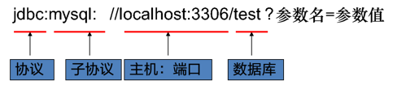

### 3.小结

作用:

1. 注册驱动
2. 获得连接

## API-Connection接口

### 1.目标

 能够使用Connection接口

### 2.讲解

1. 概述

   ​	接口的实现在数据库驱动中。所有与数据库交互都是==基于连接对象==的。

2. 作用

   ​	createStatement() ;创建执行sql语句对象

   ​	prepareStatement(String sql) ;创建预编译执行sql语句的对象

### 3.小结

1. Connection代表连接对象, 是一个接口, 实现在驱动jar包;  操作数据库都是基于Connection的
2. 作用:
   + connection.createStatement();  创建执行sql语句对象


## API-Statement接口

### 1.目标

+  能够使用Statement接口

### 2.讲解

1. 概述

   ​	接口的实现在数据库驱动中. 用来==操作sql语句(增删改查)==，并返回相应结果对象

2. 作用

   ​	ResultSet  executeQuery(String sql) 根据查询语句返回结果集。只能执行**select**语句。

   ​	int executeUpdate(String sql) 根据执行的DML（insert update delete）语句，返回受影响的行数。

   ​	boolean execute(String sql)  此方法可以执行任意sql语句。返回boolean值. 【了解】

   ​		true:  执行select有查询的结果

   ​		false:  执行insert, delete,update, 执行select没有查询的结果

### 3.小结

1. statement 作用用来执行sql语句
2. 执行查询

```
ResultSet excuteQuery(String sql);    //返回值是结果集
```

3. 执行增删改

```
int excuteUpdate(String sql);  //返回值是受影响的行数
```


## API-ResultSet接口

### 1.目标

+ 掌握ResultSet接口的使用

### 2.讲解

1. 封装结果集,查询结果表的对象;

   提供一个游标，默认游标指向结果集第一行之前。

   调用一次next()，游标向下移动一行。

   提供一些get方法。

2. ResultSet接口常用API

   + boolean next();将光标从当前位置向下移动一行
   + int getInt(int colIndex)以int形式获取ResultSet结果集当前行指定列号值
   + int getInt(String colLabel)以int形式获取ResultSet结果集当前行指定列名值
   + float getFloat(int colIndex)以float形式获取ResultSet结果集当前行指定列号值
   + float getFloat(String colLabel)以float形式获取ResultSet结果集当前行指定列名值
   + String getString(int colIndex)以String 形式获取ResultSet结果集当前行指定列号值
   + String getString(String colLabel)以String形式获取ResultSet结果集当前行指定列名值
   + Date getDate(int columnIndex);  以Date 形式获取ResultSet结果集当前行指定列号值
   + Date getDate(String columnName);以Date形式获取ResultSet结果集当前行指定列名值
   + void close()关闭ResultSet 对象

### 3.小结

#### 3.1图解

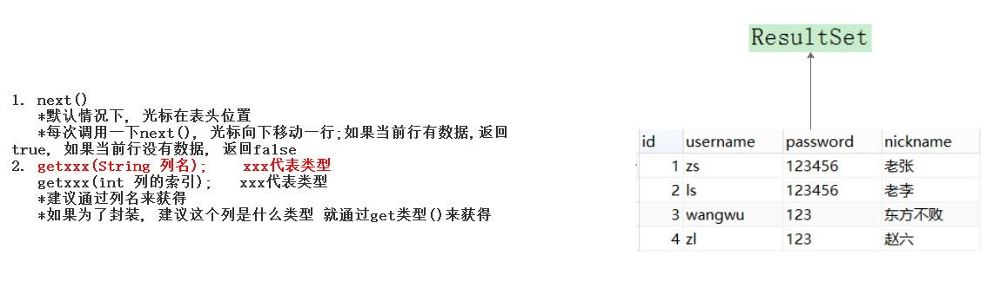 

#### 3.2封装

+ 定义一个User类

```java
package com.itheima.bean;

/**
 * @Description: user实体类, 封装数据的
 * @Author: yp
 */
public class User {

    private int id;
    private String username;
    private String password;
    private String nickname;

    //提供get/set方法 Alt+Insert


    public User() {
    }

    public User(int id, String username, String password, String nickname) {
        this.id = id;
        this.username = username;
        this.password = password;
        this.nickname = nickname;
    }

    public int getId() {
        return id;
    }

    public void setId(int id) {
        this.id = id;
    }

    public String getUsername() {
        return username;
    }

    public void setUsername(String username) {
        this.username = username;
    }

    public String getPassword() {
        return password;
    }

    public void setPassword(String password) {
        this.password = password;
    }

    public String getNickname() {
        return nickname;
    }

    public void setNickname(String nickname) {
        this.nickname = nickname;
    }

    @Override
    public String toString() {
        return "User{" +
                "id=" + id +
                ", username='" + username + '\'' +
                ", password='" + password + '\'' +
                ", nickname='" + nickname + '\'' +
                '}';
    }
}

```

+ 封装

```java
List<User> list = new ArrayList<User>();

while (resultSet.next()) {
    //每遍历一次, 就是1条记录, 就封装成一个User对象
    User user = new User(resultSet.getInt("id"),
    resultSet.getString("username"),
    resultSet.getString("password"),
    resultSet.getString("nickname")
);
list.add(user);

}
```

## API-总结

### 1.API

1. DriverManager:驱动管理器
   + 注册驱动
   + 获得连接
2. Connection: 代表连接对象
   + 创建执行sql语句对象
   + 创建预编译sql语句对象
3. Statement: 执行sql语句对象
   + 执行查询  		Result executeQuery(String sql)  返回结果集
   + 执行增删改      int excuteUpdate(String sql)   返回受影响的行数
4. ResultSet: 结果集
   + boolen next()          每调用一次, 光标就向下移动一行; 这个行有数据, 返回true; 没有数据, 返回false
   + get类型(String 列名);   根据列名 获得当前列的数据


### 2注意事项

+ 包名

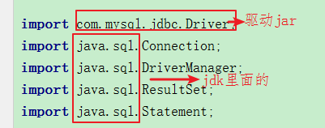 


# 第四章-JDBC操作数据库练习 #

## 知识点-单元测试介绍和使用

### 1.目标

+ 掌握单元测试的使用

### 2.路径

1. 单元测试介绍
2. 单元测试使用

### 3.讲解

#### 3.1JUnit介绍

​		JUnit是一个Java语言的单元测试jar。属于第三方工具，一般情况下需要导入jar包，不过，多数Java开发环境已经集成了JUnit作为单元测试工具.编写测试类，简单理解可以用于取代java的main方法

#### 3.2使用

+ 在测试类方法上添加注解@Test

+ 注解修饰的方法要求：public void 方法名() {…} ，方法名自定义，==没有参数==。

 

+ 添加IDEA中集成的Junit库，使用快捷键“Alt+Enter”，点击“Add Junit …”

 

+ 使用：选中方法右键，执行当前方法或者选中类名右键，执行类中所有方法（方法必须标记@Test）

 

### 4.小结


1. 常见使用错误，如果没有添加“@Test”，使用“Junit Test”进行运行，将抛异常

2. 单元测试需要注意的地方:


## 案例-增删改查练习

### 1.需求

+ 使用JDBC完成增删改查练习

### 2.步骤

1. 注册驱动
2. 获得连接
3. 创建执行sql语句对象
4. 执行sql语句, 处理结果
5. 释放资源

### 3.实现

```java
package com.itheima.b_crud;

import com.itheima.bean.User;
import org.junit.Test;

import java.sql.Connection;
import java.sql.DriverManager;
import java.sql.ResultSet;
import java.sql.Statement;
import java.util.ArrayList;
import java.util.List;

/**
 * 增删改查
 */
public class CRUDDemo {

    @Test
    //增加  insert into user values(null,'tq','77777','田七');
    public void fun01() throws Exception {
        //1.注册驱动
        Class.forName("com.mysql.jdbc.Driver");

        //2.获得连接
        String url = "jdbc:mysql://localhost:3306/web17";
        String user = "root";
        String password = "123";
        Connection connection = DriverManager.getConnection(url, user, password);

        //3.创建执行sql语句对象
        Statement statement = connection.createStatement();

        //4.执行sql语句
        String sql = " insert into user values(null,'tq','77777','田七')";
        int rows = statement.executeUpdate(sql);
        System.out.println("几行收影响=" + rows);

        //5.释放资源
        if (statement != null) {
            statement.close();
        }
        if (connection != null) {
            connection.close();
        }

    }

    @Test
    //更新 把id为5的用户的密码改成88888888
    public void fun02() throws Exception {
        //1.注册驱动
        Class.forName("com.mysql.jdbc.Driver");

        //2.获得连接
        String url = "jdbc:mysql://localhost:3306/web17";
        String user = "root";
        String password = "123";
        Connection connection = DriverManager.getConnection(url, user, password);

        //3.创建执行sql语句对象
        Statement statement = connection.createStatement();

        //4.执行sql语句
        String sql = "update user set  password = '88888888' where id = 5";
        statement.executeUpdate(sql);

        //5.释放资源
        statement.close();
        connection.close();
    }

    @Test
    //删除id为5的用户
    public void fun03() throws Exception {
        //1.注册驱动
        Class.forName("com.mysql.jdbc.Driver");

        //2.获得连接
        String url = "jdbc:mysql://localhost:3306/web17";
        String user = "root";
        String password = "123";
        Connection connection = DriverManager.getConnection(url, user, password);

        //3.创建执行sql语句对象
        Statement statement = connection.createStatement();

        //4.执行sql语句
        String sql = "delete from user where id = 5";
        statement.executeUpdate(sql);

        //5.释放资源
          statement.close();
          connection.close();
    }

    @Test
    //查询id为1的用户
    public void fun04() throws Exception {
        //1.注册驱动
        Class.forName("com.mysql.jdbc.Driver");

        //2.获得连接
        String url = "jdbc:mysql://localhost:3306/web17";
        String username = "root";
        String password = "123";
        Connection connection = DriverManager.getConnection(url, username, password);

        //3.创建执行sql语句对象
        Statement statement = connection.createStatement();

        //4.执行sql语句
        String sql = "select * from user where id = 1";
        ResultSet resultSet = statement.executeQuery(sql);

        User user = null;
        while (resultSet.next()) {
            //每遍历一次,就是一条数据.就是一个User对象(有数据才有user)
            user = new User(resultSet.getInt("id"),
                    resultSet.getString("username"),
                    resultSet.getString("password"),
                    resultSet.getString("nickname"));
        }


        //获得用户名
        System.out.println("用户名="+user.getUsername());

        //5.释放资源
          resultSet.close();
          statement.close();
          connection.close();
    }

    @Test
    //查询所有用户
    public void fun05() throws Exception {
        //1.注册驱动
        //DriverManager.registerDriver(new Driver());
        //类全限定名(带包名), 加载Driver类, 静态代码块就会执行, 驱动就注册了
        Class.forName("com.mysql.jdbc.Driver");

        //2.获得连接(连接数据库)
        //连接数据库路径
        String url="jdbc:mysql://localhost:3306/web17";
        String username = "root";
        String password= "123456";
        Connection connection = DriverManager.getConnection(url, username, password);

        //3.创建执行sql语句的对象
        Statement statement = connection.createStatement();

        //4.执行sql语句, 处理结果
        String sql = "select * from user";
        ResultSet resultSet = statement.executeQuery(sql);

        List<User> list = new ArrayList<User>();

        while (resultSet.next()){
            //每遍历一次就是一条数据, 就封装成一个User对象. 把封装的每一个User添加到list集合里面
            User user = new User(resultSet.getInt("id"),
                    resultSet.getString("username"),
                    resultSet.getString("password"),
                    resultSet.getString("nickname")
            );
            list.add(user);
        }


        //获得第二个用户的用户名
        System.out.println(list.get(1).getUsername());

        //5.释放资源(先创建的后关闭)
          resultSet.close();
          statement.close();
          connection.close();
    }
}

```

### 4.小结

1. 步骤
   + 注册驱动
   + 获得连接
   + 创建执行sql语句对象
   + 执行sql语句, 处理结果
   + 释放资源
2. 发现练习里面的代码大部分都是重复的, 所以应该抽取

## 案例-JDBC工具类的抽取

### 1.目标

​	掌握JDBC工具类的抽取

### 2.步骤

1. 在src目录下,创建配置文件
2. 定义JdbcUtils类
3. 定义getConnection()方法
4. 定义closeAll()方法

### 3.实现

- 创建配置文件,配置文件在resources目录下，并且要将resources目录标记为资源文件的根路径,扩展名是properties

  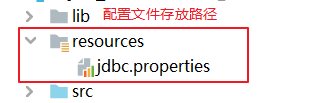

  配置文件:

```properties
driver=com.mysql.jdbc.Driver
url=jdbc:mysql://localhost:3306/day18
username=root
password=123
```

​		


-  工具类实现

```java
package com.itheima.utils;

import java.io.FileInputStream;
import java.io.IOException;
import java.io.InputStream;
import java.sql.*;
import java.util.Properties;

/**
 * @Description:JdbcUtils 工具类
 * *  1.抽取: 复用重复的代码
 * *方式: 把重复代码抽取到父类, 把公共代码抽取成方法, 把公共代码抽取到工具类
 * *原则: 抽取重复的
 * 2.选择把公共代码抽取到工具类
 * *找重复的: (1,2 -- 获得连接的方法), (5-- 释放资源的方法)
 * *思路:
 * 定义一个类
 * 在这个类里面定义两个方法
 * 3. 工具类优化
 * *把四个参数(驱动,路径,用户名,密码)抽取成 jdbc.properties
 * *在static{}里面读取jdbc.properties, 给变量赋值
 */
public class JdbcUtils {
    private static String driver;
    private static String url;
    private static String username;
    private static String password;

    //驱动只需要注册一次,把注册驱动的代码放在静态代码块
    static {
        InputStream is = null;
        try {
            //0.读取jdbc.properties, 给变量赋值
            //获得文件流 类加载器可以直接读取类路径(src)下的  new FileInputStream("F:\\workspace\\sk\\sz85\\day18_jdbc\\src\\jdbc.properties");
            is = JdbcUtils.class.getClassLoader().getResourceAsStream("jdbc.properties");
            //创建配置对象
            Properties properties = new Properties();
            //关联文件流
            properties.load(is);
            //根据key获得值
            driver =  properties.getProperty("driver");
            url =  properties.getProperty("url");
            username =  properties.getProperty("username");
            password =  properties.getProperty("password");
            //1. 注册驱动
            Class.forName(driver);
        } catch (Exception e) {
            e.printStackTrace();
        }finally {
            if(is != null){
                try {
                    is.close();
                } catch (IOException e) {
                    e.printStackTrace();
                }
            }
        }
    }

    /**
     * 获得连接
     *
     * @return
     * @throws Exception
     */
    public static Connection getConnection() throws Exception {
        //2. 获得连接
        Connection connection = DriverManager.getConnection(url, username, password);
        return connection;
    }

    /**
     * 释放资源
     *
     * @param resultSet
     * @param statement
     * @param connection
     * @throws SQLException
     */
    public static void closeAll(ResultSet resultSet, Statement statement, Connection connection) throws SQLException {
        if (resultSet != null) {
            resultSet.close();
        }

        if (statement != null) {
            statement.close();
        }
        if (connection != null) {
            connection.close();
        }

    }


}

```

### 3.小结

1. 注意实现

   + 配置文件建议定义在`src目录`

   + 使用的getProperty()方法里面的参数应该和配置文件里面的key一致, 加""

    


# 第五章-PreparedStatement #

## 案例-登录案例

### 1.需求

​	在控制台输入用户名和密码,查询数据库,如果数据库存在当前用户,显示登录成功!

​	如果数据库不存在当前用户,显示登录失败!																		


### 2分析

#### 2.1登录是做什么

+ 登录说白了就是根据**用户名和密码查询数据库**, 如果能查询出来就是登录成功, 查询不出来就是登录失败

#### 2.2思路分析

  

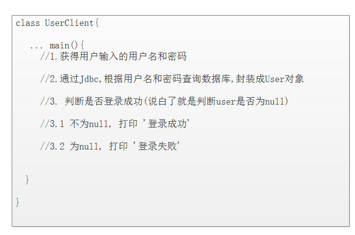 


### 3.代码实现

+ LoginClient.java

```java
public static void main(String[] args) throws SQLException {
    //登录案例:
    //1. 控制台提示:输入用户名
    System.out.println("请输入用户名:");
    //2. 获取用户输入的用户名
    Scanner scanner = new Scanner(System.in);
    String username = scanner.nextLine();
    //3. 控制台提示:输入密码
    System.out.println("请输入密码:");
    //4. 获取用户输入的密码
    String password = scanner.nextLine();
    //5. 校验用户名和密码是否正确
    //以username和password作为条件，到user表中查询
    //使用JDBC执行查询的SQL语句
    Connection conn = JDBCUtil.getConnection();
    Statement stm = conn.createStatement();

    //由于传入的password字符串，导致sql语句拼接的时候，多出来了一个恒成立or条件，这种情况叫SQL注入
    String sql = "select * from user where username='"+username+"' and password='"+password+"'";

    ResultSet rst = stm.executeQuery(sql);
    //如果结果集中有数据，就说明用户名和密码正确
    //6. 控制台输出"登录成功"或者"登录失败"
    if (rst.next()) {
        //登录成功
        System.out.println("登录成功...");
    }else {
        //登录失败
        System.out.println("登录失败...");
    }
}
```

### 4.小结

#### 4.1登录思路

+ 登录说白了就是根据用户名和密码查询数据库
+ 登录思路
  + 获得用户输入的用户名和密码
  + 使用Jdbc根据用户名和密码查询数据库 封装成User对象
  + 判断是否登录成功(判断User是否为null)
    + 登录成功 打印 '登录成功'
    + 登录失败 打印 登录失败'

#### 4.2SQL注入问题出现

当输入的密码  `' or '' = '` , 发现永远登录成功

#### 4.3SQL注入问题分析

+ 输入的密码  ' or '' = ', 语句如下

```sql
SELECT * FROM user WHERE username ='zs' AND password = '' or '' = ''
SELECT * FROM user WHERE username ='zs' AND password = '' or true
SELECT * FROM user WHERE  true
SELECT * FROM user 
```

+ 发现语句出现了sql注入问题

  把用户输入的 or 当成关键词注入到了sql语句里面了

## 案例-登录中SQL注入问题解决 ##

### 1.目标

​	能够完成PreparedStatement改造登录案例, 解决SQL注入问题

### 2.路径

1. preparedStatement介绍
2. preparedStatement的用法

### 3.讲解

#### 3.1 preparedStatement概述    

预编译SQL语句对象， 是Statement对象的子接口。

特点：

- 性能要比Statement高
- 会把sql语句先编译,格式固定好,
- sql语句中的参数会发生变化，过滤掉用户输入的关键字(eg: or)


#### 3.2用法

##### 3.2.1通过connection对象创建

- connection.prepareStatement(String sql) ;创建prepareStatement对象

- sql表示预编译的sql语句,如果sql语句有参数通过?来占位

  ```
  SELECT * FROM user WHERE username = ? AND password = ?
  ```

##### 3.2.2设置参数

- prepareStatement.set类型(int i,Object obj);参数1 i 指的就是问号的索引(指第几个问号,从1开始),参数2就是值   eg:  setString(1,"zs");   setString(2,"123456");

### 4.实现

```java
//b.创建预编译的SQL语句对象(SQL参数需要使用?占位)
String sql = "SELECT * FROM user WHERE username  = ? AND password = ?";
PreparedStatement preparedStatement = connection.prepareStatement(sql);
//c.设置参数, 执行(还是executeQuery()和executeQUpdate(), 但是不需要再传入SQL语句, 上面已经传入了)
preparedStatement.setString(1,username);
preparedStatement.setString(2,password);
ResultSet resultSet = preparedStatement.executeQuery();
```

### 5.小结

1. 注册驱动
2. 获得连接
3. 创建预编译SQL语句对象
4. 设置参数, 执行
5. 释放资源

## 案例-使用preparedStatement完成CRUD

### 1.需求

​	通过PreparedStatement完成增、删、改、查

### 2.分析

1. 注册驱动
2. 获得连接
3. 创建预编译sql语句对象
4. 设置参数 执行
5. 释放资源

### 3.实现

```java
**
 * 增删改查 ?只能占参数, sql语句里面的表名, 关键词(select,insert等等 )都不可以占
 */
public class CRUDDemo {

    @Test
    //增加
    public void fun01() throws Exception {
        Connection connection = JdbcUtils.getConnection();

        //1.创建预编译sql语句对象
        String sql = "insert into user values(null,?,?,?)";
        PreparedStatement preparedStatement = connection.prepareStatement(sql);
        //设置参数?
        preparedStatement.setString(1,"wb");
        preparedStatement.setString(2,"88888");
        preparedStatement.setString(3,"王八");

        //2.执行
        preparedStatement.executeUpdate();

        //3释放资源
        JdbcUtils.release(null,preparedStatement,connection);


    }

    @Test
    //更新 把id为7的用户的密码改成999999; update user set password  = '9999999' where id = 7
    public void fun02() throws Exception {
        Connection connection = JdbcUtils.getConnection();

        //1.创建预编译sql语句对象
        String sql = "update user set password  = ? where id = ?";
        PreparedStatement preparedStatement = connection.prepareStatement(sql);
        //设置参数?
        preparedStatement.setString(1,"99999999");
        preparedStatement.setInt(2,7);

        //2.执行
        preparedStatement.executeUpdate();

        //3释放资源
        JdbcUtils.release(null,preparedStatement,connection);


    }

    @Test
    //删除id为7的用户
    public void fun03() throws Exception {

        Connection connection = JdbcUtils.getConnection();

        //1.创建预编译sql语句对象
        String sql = "DELETE FROM user WHERE id = ?";
        PreparedStatement preparedStatement = connection.prepareStatement(sql);
        //设置参数
        preparedStatement.setInt(1,7);

        //2.执行
        preparedStatement.executeUpdate();

        //3释放资源
        JdbcUtils.release(null,preparedStatement,connection);

    }

    @Test
    //查询id为1的用户
    public void fun04() throws Exception {
        Connection connection = JdbcUtils.getConnection();

        //1.创建预编译sql语句对象
        String sql = "SELECT * FROM  user WHERE  id  = ?";
        PreparedStatement preparedStatement = connection.prepareStatement(sql);
        //设置参数?
        preparedStatement.setInt(1,1);

        //2.执行
        ResultSet resultSet = preparedStatement.executeQuery();
        User user = null;
        while(resultSet.next()){
            user = new User(resultSet.getInt("id"),
                    resultSet.getString("username"),
                    resultSet.getString("password"),
                    resultSet.getString("nickname"));
        }

        System.out.println(user);

        //3释放资源
        JdbcUtils.release(resultSet,preparedStatement,connection);

    }

    @Test
    //查询所有用户
    public void fun05() throws Exception {

        Connection connection = JdbcUtils.getConnection();

        //1.创建预编译sql语句对象
        String sql = "select * from user";
        PreparedStatement preparedStatement = connection.prepareStatement(sql);

        //2.执行
        ResultSet resultSet = preparedStatement.executeQuery();
        List<User> list = new ArrayList<User>();

        while(resultSet.next()){
            User user = new User(resultSet.getInt("id"),
                    resultSet.getString("username"),
                    resultSet.getString("password"),
                    resultSet.getString("nickname"));
            list.add(user);
        }

        System.out.println(list);
        //3释放资源
        JdbcUtils.release(resultSet,preparedStatement,connection);


    }


}
```

### 4.小结

#### 4.1步骤

1. 注册驱动
2. 获得连接
3. 创建预编译sql语句对象
4. 设置参数, 执行
5. 释放资源

#### 4.2API

1. 创建预编译sql语句对象

```
connection.prepareStatement(String sql); //sql里面有参数, 先用?代替,进行占位
```

2. 设置参数

```
prepareStatement.set类型(int 第几个问号,Object 值);
```

3. 执行

```
Result result = prepareStatement.excuteQuery();  //执行查询 不传sql语句
int rows  = prepareStatement.excuteUpdate();  //执行增删改 不传sql语句
```


#### 4.3注意事项

1. ?只能占参数,说白了就是列的值

2. ?从1开始计数

3. 执行的时候不要传入sql语句

   


# 第六章-JDBC事务的处理

## 知识点-JDBC事务介绍

### 1.目标

+ 掌握JDBC事务相关API

### 2.分析

之前我们是使用MySQL的命令来操作事务。接下来我们使用JDBC来操作事务. 先来学习下相关的API

### 3.讲解

| Connection中与事务有关的方法      | **说明**                                                     |
| --------------------------------- | ------------------------------------------------------------ |
| setAutoCommit(boolean autoCommit) | 参数是true或false  如果设置为false，表示关闭自动提交，相当于开启事务; 类似sql里面的 start transaction; |
| void commit()                     | 提交事务; 类似sql里面的 commit;                              |
| void rollback()                   | 回滚事务; 类似sql里面的 rollback;                            |

### 4.小结

```java
try{
	connection.setAutoCommit(false); //开启事务
	...操作数据库
	connection.commit(); //提交事务
}catch(Exection e){
	connection.rollback(); //回滚事务
}finally{
	...释放资源
}
```


## 案例-转账案例

+ 案例的准备工作

```sql
create table account(
    id int primary key auto_increment,
    name varchar(20),
    money double
);

insert into account values (null,'zs',1000);
insert into account values (null,'ls',1000);
insert into account values (null,'ww',1000);
```

### 1.需求

​	zs给ls转100, 使用事务进行控制

### 2.分析

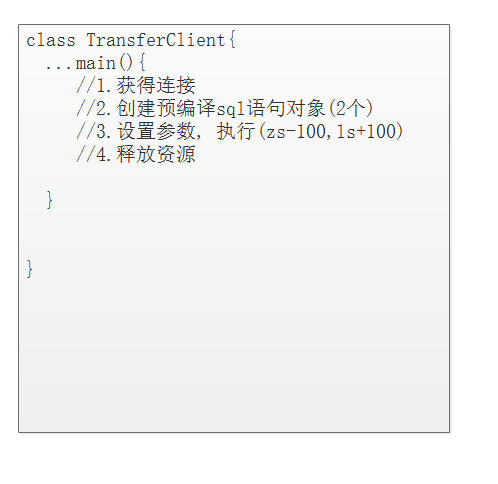 

### 3.实现

+ 代码实现

```java
package com.itheima.jdbc;

import com.itheima.utils.JdbcUtils;

import java.sql.Connection;
import java.sql.PreparedStatement;
public class TransferClient {

    public static void main(String[] args) throws Exception {
        Connection connection = null;
        PreparedStatement preparedStatement01 = null;
        PreparedStatement preparedStatement02 = null;
        try {
            //1.获得连接
            connection = JdbcUtils.getConnection();

            //*******开启事务*********
            connection.setAutoCommit(false);

            //2.创建预编译sql语句对象(2个)
            String sql01 = "update account set money = money-? where name = ?";
            preparedStatement01 = connection.prepareStatement(sql01);

            String sql02 = "update account set money = money+? where name = ?";
            preparedStatement02 = connection.prepareStatement(sql02);

            //3.设置参数, 执行(zs-100,ls+100)
            preparedStatement01.setDouble(1,100);
            preparedStatement01.setString(2,"zs");
            preparedStatement01.executeUpdate();

            int i = 1/0; //模拟出问题

            preparedStatement02.setDouble(1,100);
            preparedStatement02.setString(2,"ls");
            preparedStatement02.executeUpdate();

            //*******提交事务*********
            connection.commit();
        } catch (Exception e) {
            e.printStackTrace();
            //*******回滚事务*********
            connection.rollback();
        } finally {
            //4.释放资源
            preparedStatement02.close();
            JdbcUtils.closeAll(null,preparedStatement01,connection);
        }


    }
}

```

### 4.小结

1. 涉及到两个写的操作,我们一般通过手动事务去控制
2. JDBC操作事务API

```
connection.setAutoCommit(fasle);  //开启事务
connection.commit();              //提交事务
connection.rollback();            //回滚事务
```

# 七、扩展知识点

## 使用ResourceBundle读取properties文件中的数据

```java
@Test
public void testResourceBundle(){
    //目标:使用ResourceBundle读取jdbc.properties文件中的内容
    ResourceBundle bundle = ResourceBundle.getBundle("jdbc");
    String username = bundle.getString("jdbc.username");

    System.out.println(username);
}
```


